# DOBEE

 
 DOBEE는 약 1개월 동안 준비한 비트캠프(강남학원) 1조(팀명 : 도비스프리)의 파이널 프로젝트 입니다. 6개월 간의 배운 것을 총 활용해서 만든 프로젝트이며, 6명의 팀원이 함께 만들었습니다.
 
 프로젝트는 Spring Framework와 Node.js를 기반으로 구성되어 있습니다. 채팅 서비스의 백엔드 부분을 부분적으로 Node.js로 구현하여 여러 미흡한 점이 있습니다. 하지만 별도의 학습없이 구성원의 자체적인 스터디를 통해 만들었다는 점과 약 1개월(실제 코드 작업 시간 : 23일)이라는 짧은 기간의 프로젝트 기간이라는 점에 유의하여 봐주셨으면 좋겠습니다. 

 

# 프로젝트 주제 선정
저희는 아직 창립한지 얼마 안되고 체계가 덜 잡힌 4-5인으로 구성된 스타트업을 가정해보았습니다. 소규모 스타트업 입장에서 다음과 같은 문제의식이 존재한다는 것을 파악했습니다.  
1. 기존의 ERP 프로그램은 불필요한 기능이 많고 복잡하다.  
2. 소규모 프로젝트와 업무를 관리할 수 있는 기능이 필요하다.  
이 두가지 문제의식을 바탕으로 간편하지만 강력한 기업 관리 시스템을 만들고자 했습니다.  

 

# 프로젝트 개요
DOBEE를 사용한다면 하나의 프로그램으로 두가지 기능을 함께 사용할 수 있습니다.  ERP 측면에서는 근태, 비용과 같이 꼭 필요한 기능만을 탑재했습니다. 프로젝트 관리 측면에서는 한 페이지 안에서 간단하게 프로젝트 관리를 할 수 있도록 했습니다.
  군더더기 없이 핵심 기능만을 갖춘 DOBEE를 통해 업무 효율성을 높일 수 있도록 했습니다.

 

# 프로젝트 구성
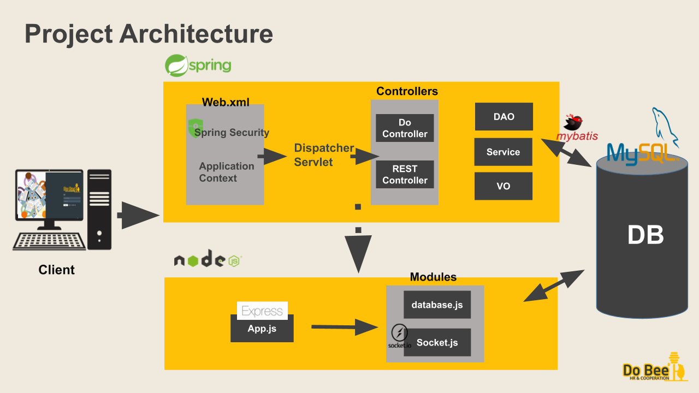

프로젝트 전반적인 구성
프로젝트는 Spring framework 와 Node.js 로 구성되어 있습니다. Spring Security를 통해 사용자 인증 처리를 진행합니다. mybatis를 통해 자바 객체를 맵핑해 db와 연결했습니다. 
데이터 베이스는 RDBMS 데이터 베이스인 mysql을 사용했습니다.
채팅 서비스의 경우 back end 부분을 Node.js로 구현했습니다. Node.js의 경우 Express를 기반으로 socket.io 모듈을 사용했습니다.

 

# 프로젝트 주요 기술 및 구현 페이지  
### Java mail sender & Velocity를 이용한 회원가입
Java mail sender와 Velocity Template을 이용해 관리자가 사원 등록시 해당 사원의 메일로 비밀번호 재설정 메일이 전송될 수 있도록 하였습니다.
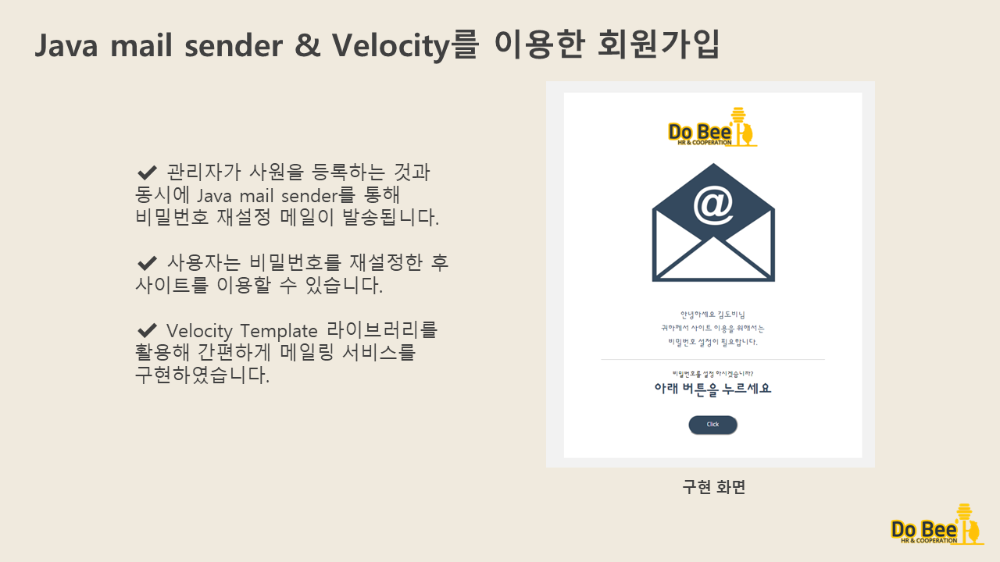  

 

### Spring Security를 이용한 사용자 인증 처리
Spring Security를 이용해 사용자 인증 처리를 구현하였습니다.  
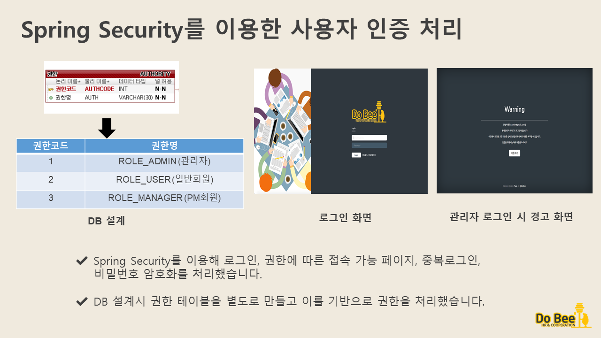  

 

### Google VISION API를 이용한 비용 처리
DOBEE는 회계팀이 따로 없는 소규모 회사를 대상으로 하는 프로그램으로, 영수증 사진 인식을 통해 쉽게 비용을 처리할 수 있습니다.  
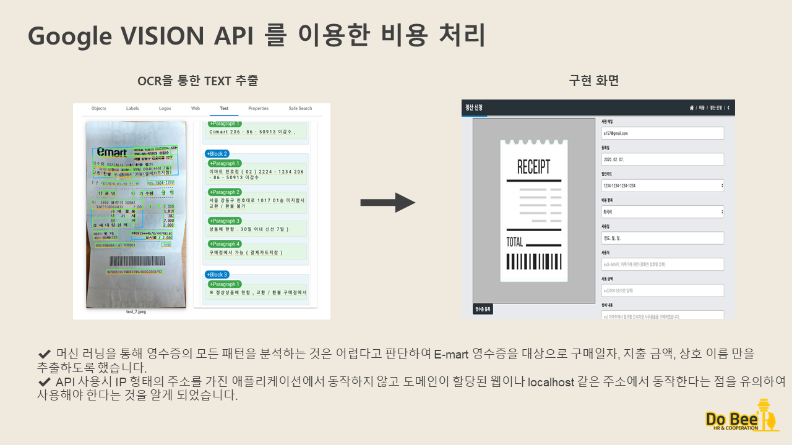  

 

### Google Drive API를 이용한 프로젝트 관리
Google Drive와 프로젝트를 연동하여 사용할 수 있도록 구현하였습니다.  
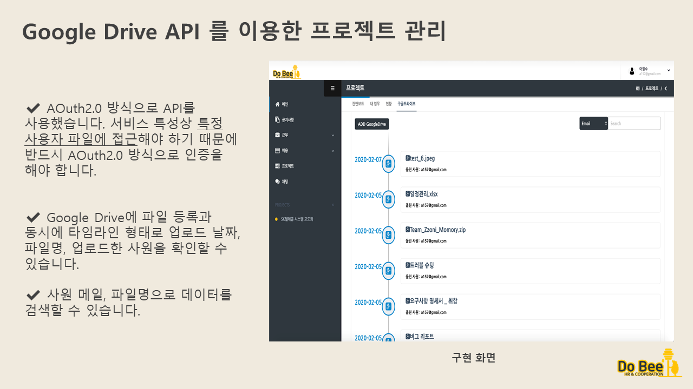  

 

### MySQL Event Scheduler를 이용한 근태 관리 
휴가나 연장근무 등의 신청이 오랜 시간이 지난 후에도 미승인으로 유지될 경우 사용자에게 불편함을 줄 수 있습니다. 이를 해결하기 위해 Event Scheduler를 활용해 미승인 건은 일정 기간이 지난 후 자동으로 반려 처리 될 수 있도록 했습니다.  
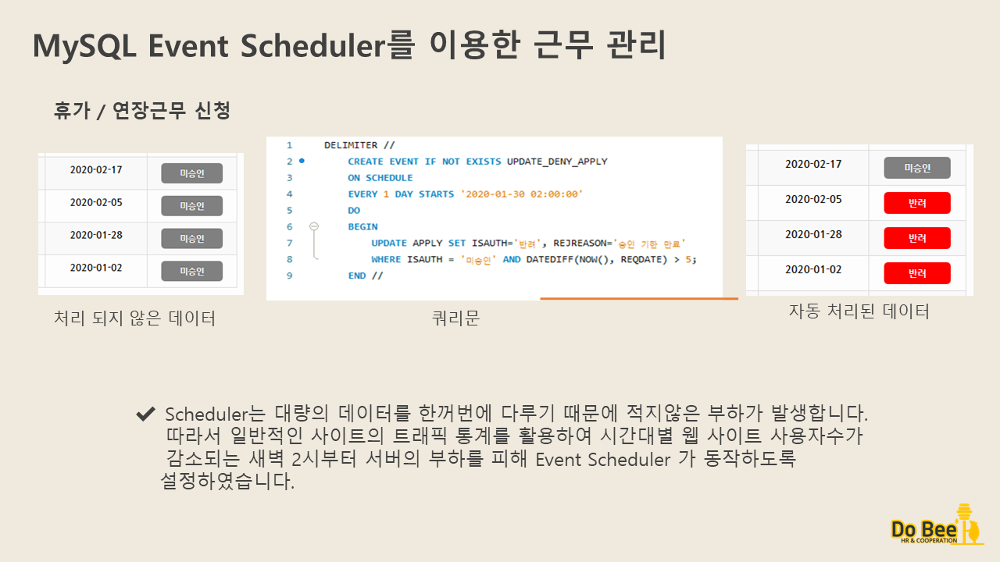  

 

### MySQL Trigger를 이용한 부재 일정 관리 
MySQL Trigger를 이용해 사용자가 연차 신청시 자동으로 연차가 계산되도록 구현하였습니다.
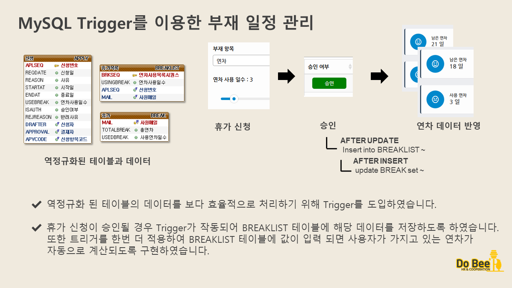 

 

### Node.js를 이용한 채팅 서비스
이벤트 기반의 비동기 프로그래밍이라는 Node.js의 장점을 기반으로 채팅 서비스를 구현하였습니다.  
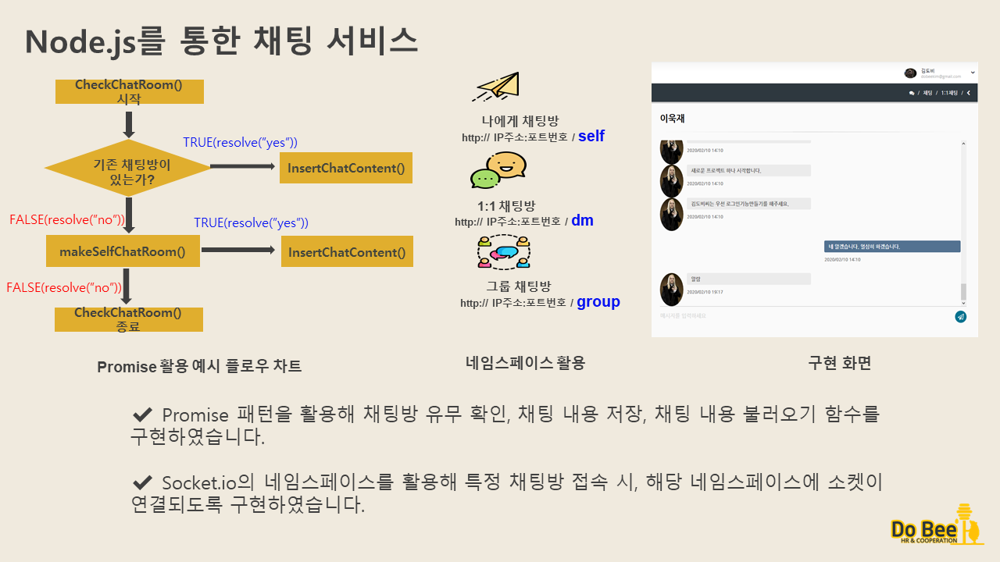  

 

### Spring WebSocket을 이용한 알림 서비스
Spring WebSocket을 이용해 새 프로젝트 생성, 새 업무 추가, 채팅 메시지 수신시 알림이 전송되는 서비스를 구현하여 사용자의 편의성을 높였습니다.  
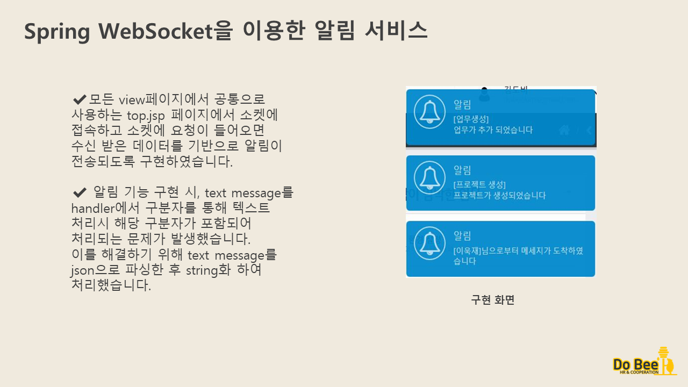  

 

### Chart API를 이용한 데이터 시각화
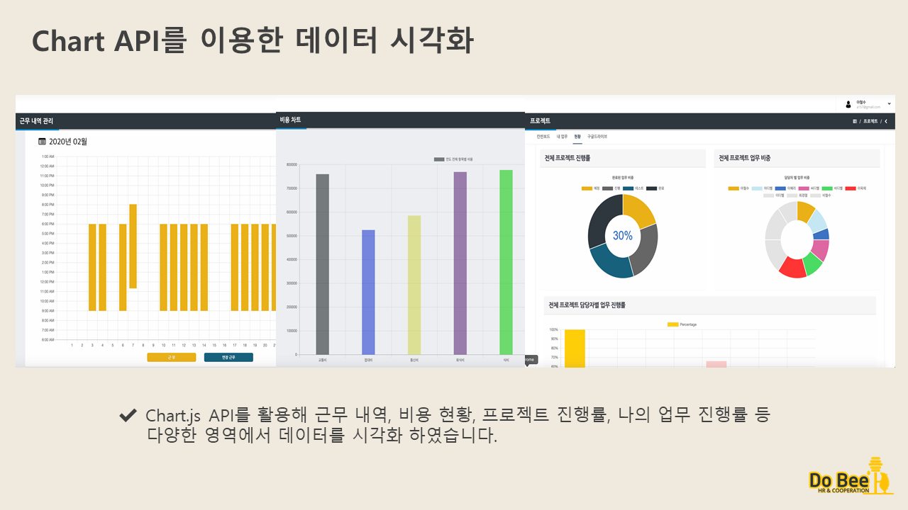  

 

## 팀원 소개
* 김광민 : https://github.com/kkm8314
* 김정균 : https://github.com/blancpaix
* 박성호 : https://github.com/kospsh157
* 이욱재 : https://github.com/uckjae  
* 이혜리 : https://github.com/hgoguma 
* 최경열 : https://github.com/dnjsvltm201311681

## 팀원별 수행 업무
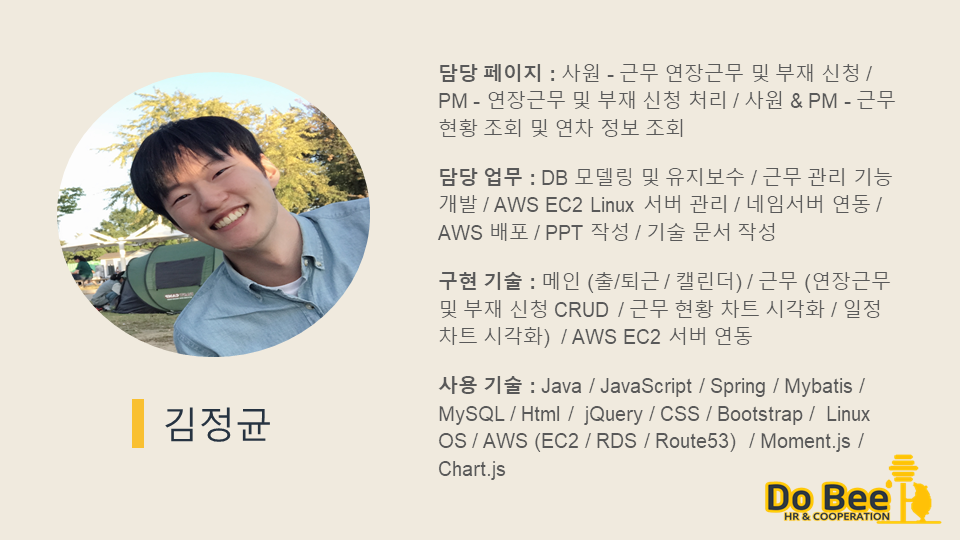
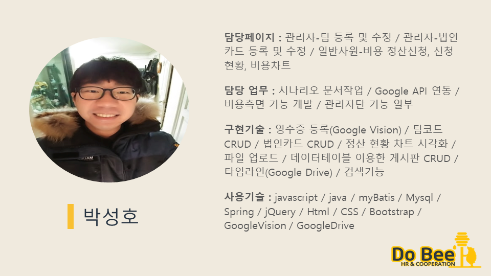
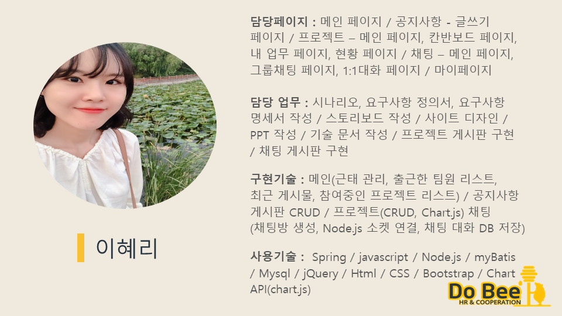

